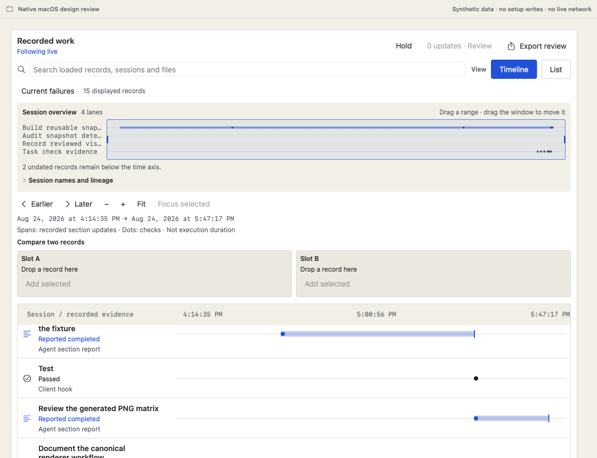
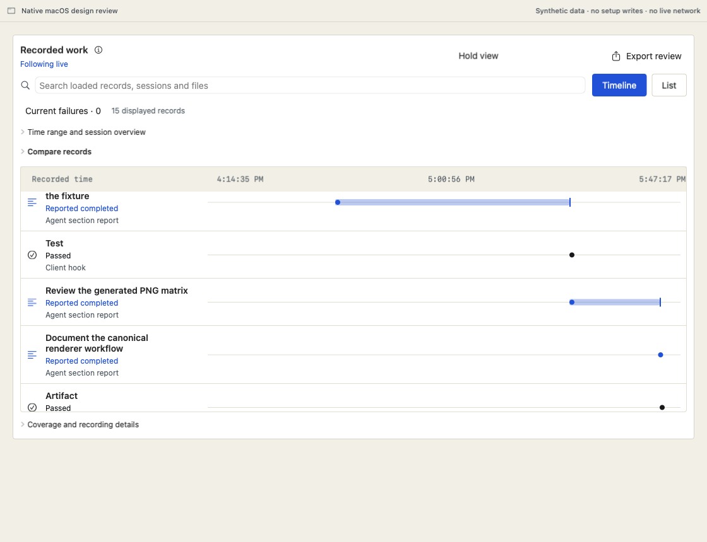

# Native recording and work review

Recording setup now opens in the main macOS window. A person chooses a coding
client, reviews the proposed user-level changes, installs, and receives explicit
activation guidance until a fresh event confirms capture. Existing work remains
reachable during recovery. Recording notices identify actionable causes without
treating a running daemon as proof of complete capture or usage attribution.

Work adds a live evidence timeline with a held history view, range navigation,
record inspection, A/B comparison, file references and a scoped text export.
New snapshots accumulate while someone investigates. Reviewing arrivals preserves
the original records, filters, disclosure choices and native scroll positions.

| Before: controls dominate the first view | After: evidence appears earlier |
|---|---|
|  |  |

[Setup at 185% text in a compact window](images/native-setup-large.png) keeps
the install scope and manual-merge qualification beside the action.

## Review the change in this order

| Area | Main files | Invariant to inspect |
|---|---|---|
| Read-only setup proposal | `src/agentacct/setup_preview.py`, `cli.py`, `tests/test_setup_preview.py` | Generate managed snippets without running setup or returning unrelated existing values. Unsupported configuration stays unresolved. |
| Capture lookup | `v1_sessions.py`, `api.py`, `SetupCaptureLookup.swift`, `SetupCaptureObserver.swift` | Filter client before pagination; confirm only the selected client's event after the effective boundary. |
| Setup and recovery | `NativeSetupFlow.swift`, `NativeClientActivationView.swift`, `SetupModel.swift`, `RecordingSetupRoute.swift` | Review scope before installation; reconnect preserves existing client configuration and guarded recorder ownership. |
| Health | `RecordingHealth.swift`, `RecordingHealthViews.swift`, `RecordingConnectionHistory.swift`, `SourcesPane.swift` | Reachability, capture, importer health and historical coverage remain distinct. Current causes precede routine diagnostics. |
| Saved work | `SavedWorkSnapshot.swift`, `SavedWorkView.swift`, `GlanceClient.swift` | Saved responses belong to the same store, retain their own timestamps and cannot fall through to network writes. |
| Timeline data and navigation | `WorkTimelineModel.swift`, `WorkTimelineMemory.swift`, `WorkTimelineViewport.swift`, `WorkTimelineFocus.swift` | Event identity, chronology, source and held snapshots remain authoritative. Selection is independent of the reading position. |
| Timeline presentation and export | `WorkTimelineView.swift`, `WorkTimelineOverview.swift`, `WorkTimelineExport.swift` | No inferred causality or execution duration; comparison/export retain full identities and qualifications. |
| Information hierarchy | `ContextHelp.swift`, `ReadingSize.swift`, `Theme.swift`, `UsagePane.swift`, `UsageCapacity.swift` | Optional explanation is available by hover and keyboard; failures, cost basis, incomplete capture and install scope stay visible. |

The backend and native application are separate commits. Synthetic review
fixtures are included; frozen reviewer source copies and large image corpora
are local study artifacts, not production resources.

## Information placement

- Remove redundant labels and empty update counts. Keep space reserved for
  arrivals so a new count does not move held history.
- Put supplemental explanation in an information icon with native hover help
  and a selectable popover reachable by keyboard. Use named disclosures for
  structured detail such as exact identities, capture proof and diagnostics.
- Keep current status and material qualifications visible. Setup's scope and
  possible manual merge steps remain beside Install. Usage keeps cost basis and
  partial subtotals beside monetary values.
- Collapse the optional overview and unused comparison workspace. Explicit
  comparison opens its workspace; background updates do not collapse it.
- Enlarged text reflows actions and evidence sections. Compact navigation keeps
  destination names in a picker instead of relying only on icons.

In the same 1120×860 synthetic timeline, the first evidence row moves from
vertical position 610 to 304: 306 points recovered. The control region contains
129 versus 43 OCR whitespace words. This is rendered geometry, not measured
human comprehension or distraction. A separately preserved single-analyst
monitoring audit classifies incidental weighted units as 18/41 versus 2/18;
those classifications depend on the monitoring task and declared unit weights.

The new evaluation uses 100 fresh evaluator agents: 50 baseline inspections and
50 masked paired comparisons across ten tasks and five contexts. The protocol
was fixed before review. Ordinal ratings, hard constraints, raw disagreements
and ten weight sensitivity variants are reported separately from machine tests.
Agents are not human participants, and preference between two candidates does
not establish a universal optimum. Final results are added after all reviews
are sealed.

## Native review without installation

From the repository root:

```sh
swift build --package-path apps/agentacct -c release
apps/agentacct/.build/release/agentacct --native-review \
  design-plans/native-macos-overhaul/fixtures/live-progress.json
```

The scene picker includes setup, pending/failure/recovery, source health, saved
work, comparison, and live sample progression. The fixture uses inert installer
callbacks and makes no live recorder requests. Use Reading at 100% and 185%,
including a 960×640 content window. A separate
`parallel-session-identity.json` fixture exercises similarly named session IDs.

## Verification and remaining limits

- Swift release suite with coverage: 435 reported tests, six canonical visual
  skips, zero failures. Targeted cases include partial resolutions, artifact
  redaction, full comparison identities, scoped export, saved timestamps,
  file-filter restoration and native scroll offsets.
- Python tests cover proposals for all four setup clients, reconnect ownership,
  session filtering before pagination, and timezone-independent timestamp bounds.
  The full final count and coverage audit are recorded with the delivery.
- Seventy-eight local PNGs cover the baseline counterparts plus enlarged
  Dashboard and Usage. Native interaction checks separately verify history
  restoration, keyboard setup, help access, comparison and export.
- The current local macOS renderer is 26.5.1; canonical pixel references require
  26.6. Do not regenerate canonical references from this Mac. CI must verify
  those baselines or produce reviewed replacement candidates.
- Coverage identifies exercised code, not correctness. Swift UI action paths,
  full VoiceOver use, operating-system Login Items approval, and every lifecycle
  interruption are not exhaustively established by the local checks.

Packaging requires a clean source commit and an embedded CLI carrying the same
provenance. Source edits alone do not update an installed app or recorder.
